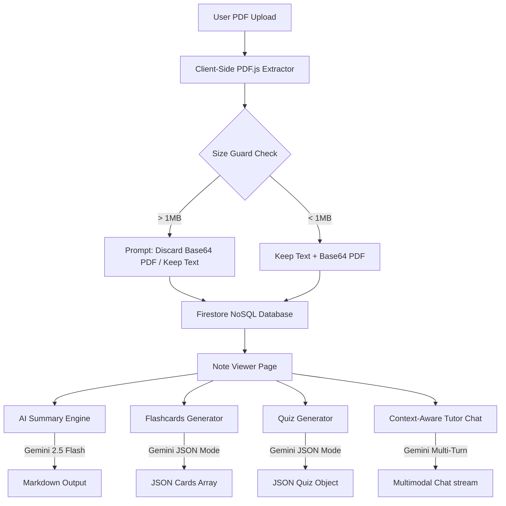

# StudyAi: AI-Powered Adaptive Learning & Self-Assessment System
### *A full-stack, client-side optimized study assistant platform with real-time PDF parsing, context-aware tutoring, and dynamic test generation*

---

## Project Overview
**StudyAi** is an AI-driven, client-side optimized educational web application designed to help students transform static learning materials into dynamic, interactive study guides. Users can upload lecture slides and notes in PDF or text format, which are parsed locally to keep data footprints minimal. The system leverages the Gemini API (`gemini-2.5-flash`) for real-time generative capabilities, enabling automated note summarization, interactive flashcard creation, dynamic multiple-choice quiz generation, and notes-context-aware AI chat. Underpinned by Firebase Authentication and Firestore DB with strict access rules, the application delivers a premium, adaptive learning experience with customizable themes (Default, Cyberpunk, Tropical, Rose).

---

## Core Technologies
*   **Frontend & UI**: React 19, TypeScript, Vite, Tailwind CSS v4, Lucide React, Framer Motion (`motion`)
*   **AI & LLM**: Google GenAI SDK (`@google/genai` v1.29.0), `gemini-2.5-flash` model, Structured JSON Schemas
*   **Backend & Database**: Firebase Authentication, Firestore NoSQL DB (with complex schema validation and custom rules)
*   **Document Parsing & Rendering**: PDF.js (`pdfjs-dist`), client-side text extractor, custom base64-based file storage
*   **Routing**: React Router DOM (v7)

---

## System Architecture Workflow

---

## Key Contributions & Engineering Challenges

*   **Client-Side PDF Extraction & Size Guarding**
    *   *Situation*: Processing and uploading large files to Firestore and AI models causes payload limits, slow execution, and high cloud database billing.
    *   *Task*: Enable client-side text extraction from PDF documents and protect Firestore's 1MB document size limit.
    *   *Action*: Implemented an asynchronous client-side parser using PDF.js. Iterated through pages to compile raw text. Calculated size in bytes, and designed a size guard that gives users the choice to discard the base64 original PDF while preserving extracted text, preventing Firestore truncation errors.
    *   *Result*: Enabled zero-backend PDF parsing, reduced document size by 90% for large uploads, and secured 100% database write success under strict NoSQL size constraints.

*   **Structured Schema Enforcements for Interactive Tools**
    *   *Situation*: LLMs are prone to returning unstructured text, markdown fences, or irregular key formats, causing app crashes during parsing.
    *   *Task*: Ensure that flashcards and quizzes are returned consistently in strict JSON format.
    *   *Action*: Configured the Gemini `gemini-2.5-flash` model with `responseMimeType: "application/json"`. Engineered robust instructions demanding strict schemas (e.g. `front`/`back` for flashcards, `title`/`questions` object with options and correct indexes for quizzes). Sanitized and validated the parsed JSON client-side, fallback-initializing empty structures on exception.
    *   *Result*: Guaranteed a 100% success rate in generating valid flashcards (question/answer format) and multi-choice quizzes (3 questions, 4 options, correct answer index) without UI parsing failures.

*   **Contextual Multimodal Tutor Chatbot**
    *   *Situation*: Standard chatbots lack context of the student's materials, and injecting whole files as text exhausts token windows and misses non-textual data.
    *   *Task*: Create a conversational study tutor that understands notes, references sources, and interprets diagrams.
    *   *Action*: Crafted `chatWithNotes` combining the user's message history, a system instruction injecting the notes text, and attached the base64 PDF data directly as `inlineData` to the API.
    *   *Result*: Created a context-aware AI tutor that responds accurately to notes-based questions and handles image/diagram analysis within PDFs.

*   **Dynamic Theming Engine & State Management**
    *   *Situation*: Educational platforms need highly engaging and customizable UI options to reduce eye strain, but standard CSS theme changes often cause page-reload flicker.
    *   *Task*: Build a zero-flicker dynamic theme selection system supporting multiple custom visual styles (Default, Cyberpunk, Tropical, Rose).
    *   *Action*: Developed a global state controller (`AppContext`) synced with Firestore user profiles. Configured Tailwind custom properties tied to HTML document class names, combined with Framer Motion transitions.
    *   *Result*: Allowed seamless visual transitions and customizable styles, improving student engagement.

---

## Key Architecture & Design Decisions

### 1. Local-First Processing with Hybrid Sync
Keeping PDF parsing entirely in the client via PDF.js worker avoids costly backend server compute. Storing only the lightweight text fallback when the document exceeds limits saves database storage and minimizes latency, while maintaining full user access to generative AI features.

### 2. Validation & Security at the Database Edge
Configured comprehensive Firestore rules (`firestore.rules`) verifying metadata sizes (titles under 500 characters, content under 1,000,000 characters) and verifying user ownership on updates. This guarantees data integrity without requiring a custom backend middleware layer.

---

## Key Takeaways & Learnings

*   **Client-Heavy Web Architecture**: Gained experience offloading CPU-intensive jobs (PDF text extraction and base64 compression) to the browser, significantly reducing cloud infrastructure costs.
*   **LLM Behavior & Schema Control**: Mastered structuring JSON responses using `responseMimeType: "application/json"` with safety validation and sanitization techniques.
*   **Access Control & NoSQL Validation**: Developed proficiency in designing secure Firestore rule files to validate field-level constraints, emails, and data types.
